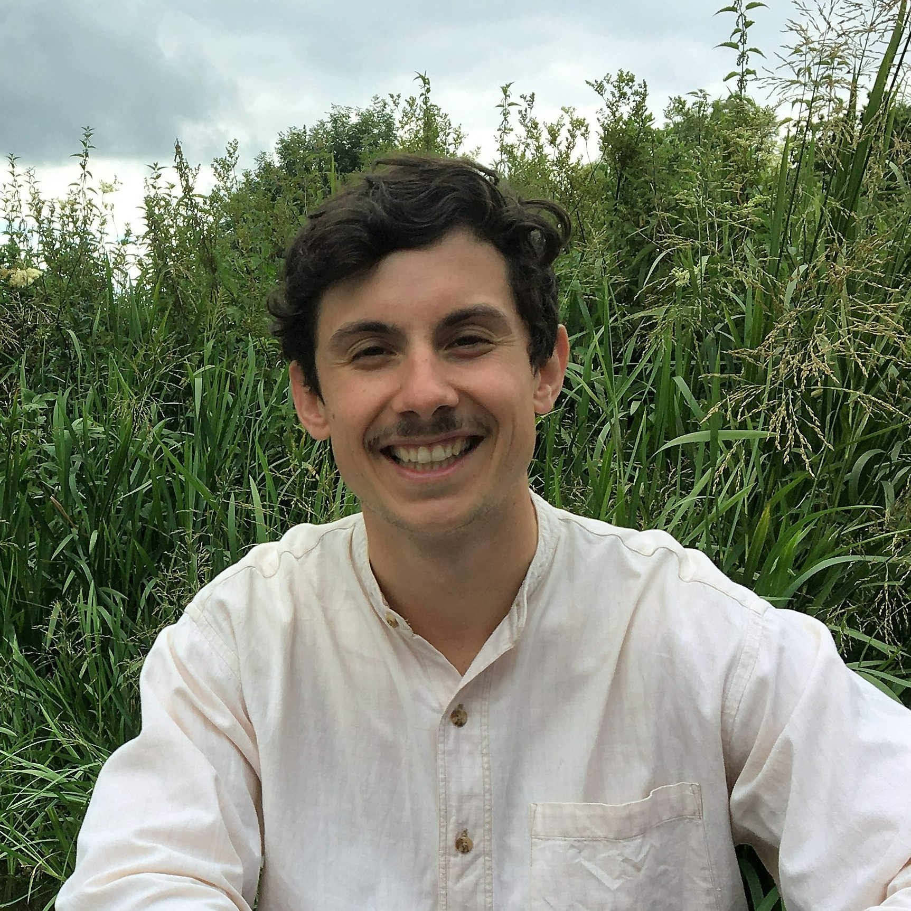

Hi, I’m Alex, a reinsurance and humanitarian professional with a background in geophysical sciences. I am currently studying for a PhD in the School of Geography, Development & Environment at the University of Arizona. In my research, I seek to answer questions around disaster risk management and risk financing for extreme climate events. My work combines remote sensing, machine learning and statistical methods to enhance our understanding of agricultural weather risks in settings spanning rural Bangladesh to the US Midwest.

### My background

Prior to my current position in the [Social Pixel Lab](https://beth-tellman.github.io/) at the University of Arizona led by Dr Beth Tellman, I worked as a technical advisor for [Start Network](https://startnetwork.org/), supporting NGOs to develop disaster risk financing systems to support the most vulnerable during crises. In the role, I produced technical evaluations of systems across Asia and Africa.

Before entering the humanitarian sector, I worked for a global reinsurance broker as a risk analyst, modeling the possible impacts of catastrophes on insured assets. It was in this position I started to become interested in the role of (re)insurance in enhancing the resilience of people and economies to disaster events, which included working with country governments to design and establish new macro reinsurance programs.

### Education

I am currently studying for my PhD at the University of Arizona. I completed my Geophysical Sciences undergraduate and masters degrees at the University of Leeds in the UK, including a year of study at the Victoria University of Wellington in New Zealand.

* _2022-present (ongoing):_ PhD, School of Geography, Development and Environment, University of Arizona, USA
* _2013-2017:_ MGeophys and BSc, Geophysical Sciences, University of Leeds, UK

_Thanks for visiting my webpage! Please contact me using the links at the bottom of this page if you would like more information or to connect with me._