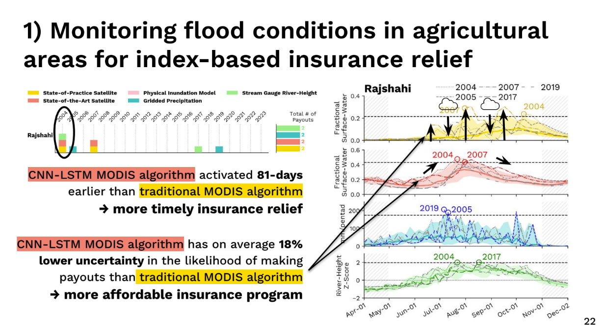
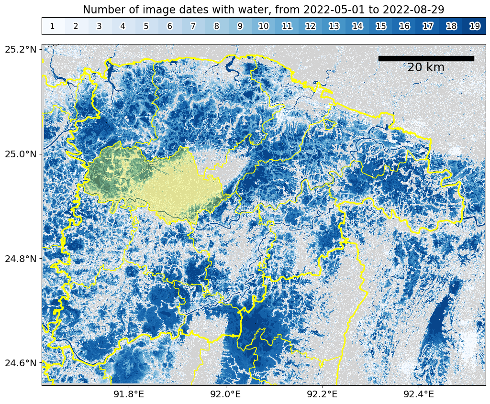

**You can find some of my recent academic presentations below:**

_American Geophysical Union (AGU), December 2024, Washington D.C., USA_ - [“Global Near Real-Time Daily Inundation Mapping using VIIRS Satellite Imagery and Deep Learning”](https://drive.google.com/file/d/1jgvXb1V442mS0NiCIZGfLshjBIufG-hf/view?usp=sharing)

_American Geophysical Union (AGU), December 2024, Washington D.C., USA_ - [“Addressing flood risks to agriculture with satellites and machine learning”](https://drive.google.com/file/d/1sffBxpeEQm933uzoiTeDAce15ofWbuBF/view?usp=sharing)

_**[Student poster award winner]** Computational Methods in Water Resources (CMWR), October 2024, University of Arizona, USA_ - [“Global Near Real-Time Daily Inundation Mapping using VIIRS Satellite Imagery and Deep Learning”](https://drive.google.com/file/d/1L0ZFkv0LA68ATrT_D-M4X4uAJQ9J7akI/view?usp=sharing)

_Arizona Institute for Resilience, International Resilience, Climate Adaptation in the Global South, April 2024, University of Arizona, USA_ - [“Index-based flood insurance in Bangladesh: some thoughts and related research”](https://drive.google.com/file/d/1wRE8XTevCgJKFCv-pfxtcQctm2ZZkwuH/view?usp=sharing)

_Copernicus Emergency Management Services, 3rd Global Flood Forecasting & Monitoring Meeting, March 2024, Online_ - [“A Comparison of Sentinel-1 Approaches to Map the May-June 2022 Floods in Sylhet, Bangladesh”](https://drive.google.com/file/d/11eREHgtePGY5xNy7PuiQ7RjoXb6mNLKz/view?usp=sharing)

_Institute of Electrical and Electronics Engineers (IEEE) International Geoscience and Remote Sensing Symposium (IGARSS), July 2023, Pasadena, CA, USA_ - [“A Comparison of Remote Sensing Approaches to Assess the Devastating May-June 2022 Flooding in Sylhet, Bangladesh”](https://drive.google.com/file/d/1WzTTe189PvqW6jx2WFvjMq3vR3rCYu3J/view?usp=sharing)

_American Geophysical Union (AGU), December 2022, Chicago, IL, USA_ - [“Assessing Danger Levels in Flood Early Warning in Sylhet, Bangladesh: A Comparison Between Hydrological and Remote Sensing Based Methods”](https://drive.google.com/file/d/157xUysEYhqSzgEU3jW05oLFvkKjDsqNO/view?usp=sharing)

