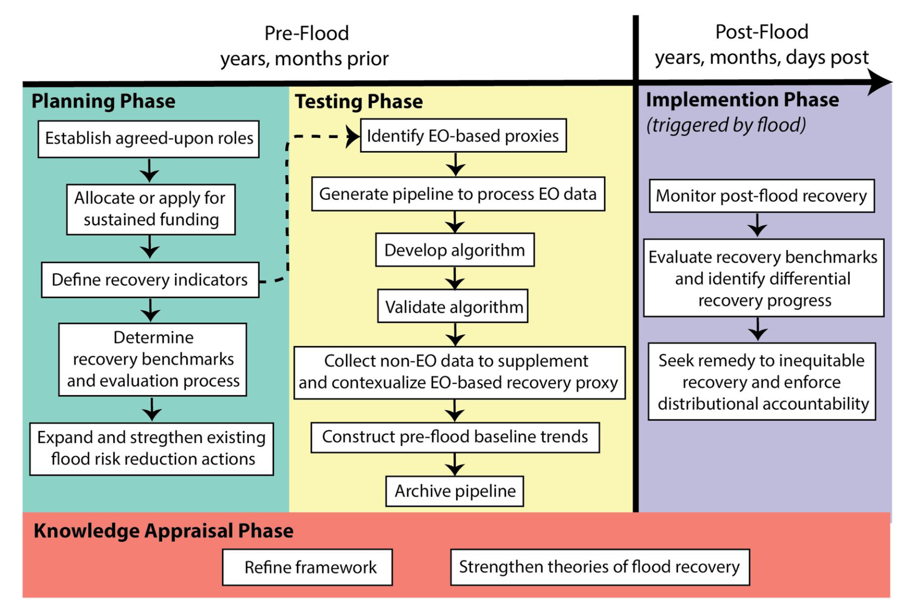

While Earth Observations (EO) are now widely used to understand where and when floods happen, rarely are they used to monitor what happens in communities after floods, and how that might differ amongst different parts of society. In our new paper [_Earth Observation to Address Inequities in Post-Flood Recovery_](https://agupubs.onlinelibrary.wiley.com/doi/10.1029/2023EF003606), led by my colleague and fellow graduate student, __Hannah Friedrich__, along with co-authors from the University of Arizona and beyond, we argue that EO is well positioned to monitor post-flood recoveries. Furthermore, EO-based monitoring is necessary to identify inequitable recovery outcomes that result from unjust practices of disaster mitigation and assistance.

With its ever-increasing capacities across spatial, temporal and spectral scales, we believe that EO can support flood recovery through:

1. Mapping flood extents

2. Monitoring impacts

3. Flood risk reduction and financing

4. Evaluating flood-related adaptation programs

And while various entities already provide flood mapping services to support disaster response and relief activities (such as the European Union's Copernicus Emergency Management Service), we find critical gaps that prohibit these initiatives from revealing important flood inequities: (1) we need longer-term, systematic monitoring, (2) with separate measurements made across different communities with differential recovery experiences, and (3) with EO deployed purposefully for characterizing recovery trends.

To support this movement towards post-flood recovery monitoring, we present a framework for EO-based monitoring, incorporating local governance and accountability, partner-engagement, recovery indicators and benchmarks across planning, testing and implementation phases. We hope this framework will motivate EO and environmental justice practitioners and provide the blueprint for successful collaboration to redress inequitable post-flood recovery outcomes.

I encourage you to also check out Hannah's recent [Twitter thread](https://x.com/hk_friedrich/status/1761049707327971470) for a brilliant summary of the paper: _"This is a call to action for EO scientists to seek funding so partners can hold leadership in scoping out recovery monitoring."_

_Framework we propose to use EO to monitor flood recovery and redress inequitable recoveries [(Friedrich et al., 2024)](https://agupubs.onlinelibrary.wiley.com/doi/10.1029/2023EF003606)._

