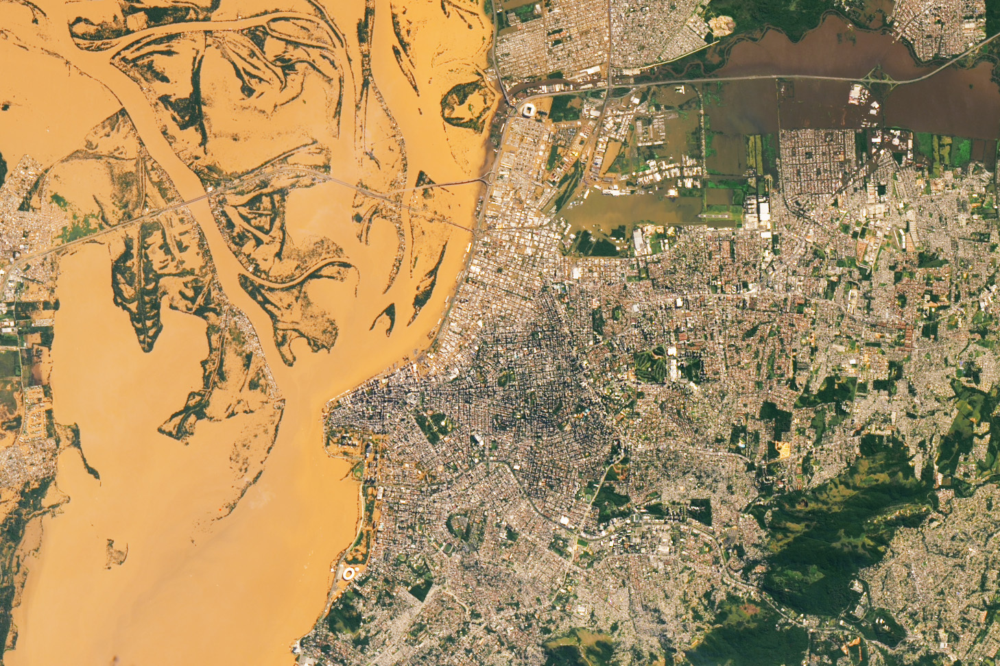

In our [new publication published last week](https://agupubs.onlinelibrary.wiley.com/doi/10.1029/2025EF005966?af=R) in the AGU journal, [_Earth's Future_](https://agupubs.onlinelibrary.wiley.com/journal/23284277), co-authors and I find that the choice of dataset used in index-based flood insurance programs directly controls the years in which payouts are made and how timely those payouts are, with potentially great implications for communities living in flood-prone areas.

### Growing interest and investment in index-based flood insurance using Earth Observations data

Floods have repeatedly shown themselves to be catastrophic for development, health, and prosperity across the globe. Yet, data shows that less than one fifth of economic flood losses are insured (based on author calculations using insured and economic loss data between 2000--2023 from [AON](https://www.aon.com/en/insights/reports/climate-and-catastrophe-report)). 

Index-based flood insurance has received growing interest and investment as part of efforts to close the flood protection gap; with payouts based on the value of a pre-defined index rather than on a claim made by a policyholder, index-based flood insurance has the potential to make fast payouts with reduced administrative costs. For example, commercial flood insurance policies in the U.K. have made [payouts in just hours following major flooding](https://floodflash.co/floodflash-pay-claim-in-under-4-hours/) using custom sensors affixed to the outside of insured facilities. Recently, [municipalities in California have purchased index-based insurance contracts](https://www.bloomberg.com/news/features/2025-03-11/a-bay-area-city-pioneers-urban-scale-insurance-for-climate-disasters) using near real-time observations of floods from satellites. Programs using satellite-derived information to provide financing for urban flood risks have also [received backing from the United Nations Development Program and the German Development Bank](https://irff.undp.org/press-releases/public-private-partnership-develop-flood-insurance-and-build-financial-resilience).

_Observations of flooding from satellites---like this example from NASA's Landsat-8 instrument of sediment-laden flood waters in southern Brazil---are increasingly being used to activate insurance payouts in "index-based" flood insurance programs. Source: [NASA Earth Observatory](https://earthobservatory.nasa.gov/images/152795/floods-engulf-porto-alegre)._

The growing interest and diversity of approaches to index-based flood insurance along with an ever-increasing array of publicly available Earth Observations data products and environmental variables brings to the forefront the question, _"how do we know which type of data and approach are best?"_. Unfortunately, choosing the most appropriate measure of flooding is rarely straightforward and existing programs have failed to openly publish convincing validation around this choice. Motivated by this knowledge gap, our study sought to demonstrate _the extent to which the choice of data can influence insurance outcomes over selecting alternative data sets_.

### Data choice controls the accuracy, timeliness, and uncertainty of indexed payouts

Our study focused on a range of environmental datasets already used or proposed for index-based flood insurance. We performed our analysis in Bangladesh, whose history of multiple humanitarian flood disasters and its [real-world efforts to manage flood impacts through satellite-based index insurance](https://green-delta.com/compensation-for-bangladeshs-farmers-hit-by-floods/) make it an ideal area to study the sensitivity of index-based insurance outcomes to dataset selection.

Our results highlight the potential for wide divergence in indexed payout outcomes arising from data selection, emphasizing the importance of choosing the right dataset through a process of a extensive testing and evaluation. In particular, we found that a state-of-the-art machine learning approach to satellite-based inundation (from [Giezendanner et al., 2023](https://openaccess.thecvf.com/content/CVPR2023W/EarthVision/html/Giezendanner_Inferring_the_Past_A_Combined_CNN-LSTM_Deep_Learning_Framework_To_CVPRW_2023_paper.html)) paid out on average one week earlier than a satellite dataset like the one previously used operationally in Bangladesh. More timely insurance relief can be critical to help households avoid the enduring negative impacts of floods, especially in developing regions like Bangladesh. What's more, the state-of-the-art satellite approach also reduced the uncertainty associated with the payouts, which contributes to lower insurance premiums. With index-based programs often targeting low-income populations or relying on subsidies, identifying datasets which reduce uncertainty is critical to develop cost-efficient and long-lasting programs.

_We simulated historical index-based flood insurance payouts in Bangladesh using five types of environmental dataset (only four are shown in the image). While some datasets are in close agreement, other datasets diverge materially in the years in which payouts are made and how timely they are (i.e., how soon payouts were activated following extreme conditions), especially at increasingly localized scales. Even in the case of two datasets derived from the same satellite instrument (but using different methods, shown in the image in yellow and red colors, respectively), the timing of payouts during extreme flood years sometimes differed by several weeks to months. Timely insurance relief is essential for households without access to other contingency funds to weather flood impacts._

### Our recommendations to practitioners 

Based on our findings, we propose four important considerations for practitioners working on current or future index-based flood programs:

1) **Test a range of datasets to identify which best meets needs of the program, paying attention to the relevant spatial scale:** in particular, being aware that error rates can be higher at finer spatial scales.

2) **Compare multiple indices to identify if additional program actions are needed to manage lower confidence in index-based payouts:** assessing multiple indices in a "convergence/diverge-of-evidence" approach can help to highlight regions benefitting from "back-up" payout mechanisms or additional risk assessment activities.

3) **Evaluate new data sources that can improve payout timeliness or reduce uncertainty:** including machine learning (i.e., AI) methods, which should not necessarily be assosicated with prohibitive overheads, as we show with our state-of-the-art approach.

4) **Select data that capture relative variability in intensity:** indices that consistently track variation over time and space are more helpful than indices which capture the "absolute" accuracy at a single point in time.

On top of our recommendations, we encourage practitioners to use our approach to test their own candidate datasets in other regions while evaluating against observed damages for pre-identified communities or assets. Looking forward, better data on the human impacts of flood disasters will enable practitioners to assess indexed flood programs not only on the provision of indexed payouts but on their contribution to household welfare. We welcome novel research to collect data on the human impacts of flooding and generate methodological frameworks for incorporating these estimates.

If you are interested in learning more about this study, please don't hesitate to contact me: [alexsaunders@arizona.edu](alexsaunders@arizona.edu)

### Acknowledgements

I would like to thank my co-authors, **Beth Tellman** (University of Wisconsin---Madison, previously University of Arizona), **Elinor Benami** (Virginia Polytechnic Institute and State University), **Kevin Anchukaitis** (University of Arizona), **Sazzad Hossain** (Bangladesh Water Development Board), **Andrew Bennett** (University of Arizona), **AKM Saiful Islam** (Bangladesh University of Engineering and Technology), and **Jonathan Giezendanner** (Massachusetts Institute of Technology, previously University of Arizona). You can find Jonathan's original publication of the state-of-the-art satellite inundation dataset we used in this study [here](https://openaccess.thecvf.com/content/CVPR2023W/EarthVision/html/Giezendanner_Inferring_the_Past_A_Combined_CNN-LSTM_Deep_Learning_Framework_To_CVPRW_2023_paper.html). 

Thanks also to **Md Ariffuzaman Bhuyan** and colleagues at the **Bangladesh Flood Forecasting and Warning Center** for their partnership, support, and access to stream gauge data. I also thank **Michael Steckler** for providing additional stream gauge data. Finally, thanks to **Max Mauerman** for providing helpful early feedback on the manuscript and to the two anonymous reviewers for their useful comments.

This work was funded by a grant from the NASA New Investigators (NIP) Program (80NSSC21K1044).

